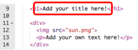

# Translating HTML, CSS and JavaScript

HTML, CSS and JavaScript are three key languages used for web development: HTML gives the web page structure and defines the content, CSS is used to apply styling to HTML content, and JavaScript is used to make the content dynamic (e.g. animate images). 

## HTML

HTML describes the structure of web pages with the help of tags. Tags define how a web browser should format and display the content. 

- Most tags have two parts – the opening (e.g. `<h1>`) and the closing part (e.g. `</h1>`). These tags **should not be translated**.

- Some HTML tags will contain information within them – that information should not be translated.

- You will notice that there are some strings of text inserted between the opening and the closing tag – these strings **should be translated** because this is the text that is displayed on the webpage.

## CSS

CSS code **should not be translated**.

## JavaScript

JavaScript code **should not be translated**.

## About the tools

Find out [how to translate HTML code in Trinket](https://github.com/ninaszymor/Raspberry-Pi-Translation-Guide/blob/master/Tools/Trinket.md)

Find out [how to translate HTML instructions in the different types of files in Crowdin](https://github.com/ninaszymor/Raspberry-Pi-Translation-Guide/blob/master/Tools/Files%20in%20Crowdin.md)
