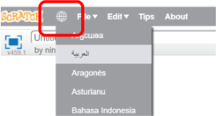
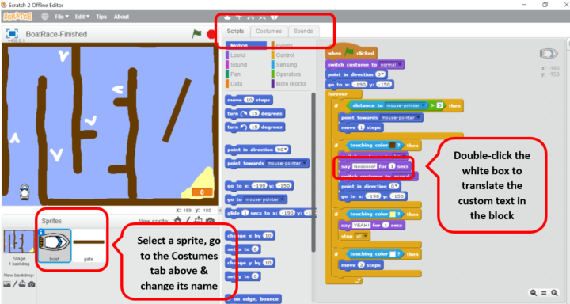

# Translating Scratch

Scratch is a visual programming language that helps young people learn to think creatively, reason systematically and work collaboratively. It enables kids to program their own interactive stories, games and animations. 

Scratch is available in a number of languages which means that the code in Scratch projects will need to be translated in line with the **official Scratch translation**. You can change the language of Scratch Editor by clicking the globe icon and selecting the language you're translating:

Changing the language will automatically translate the user interface and Scratch blocks but it won't translate names of variables, sprites, costumes, sounds, or text in say/think/ask blocks and operator blocks - you will have to **translate these manually**:

Please note that if your language isn’t supported, please leave the code in English but translate the abovementioned elements.

When translating Scratch syntax in the markdown files, please use [this Scratch translator](http://scratchblocks.github.io/translator/). This is what Scratch syntax looks like:

