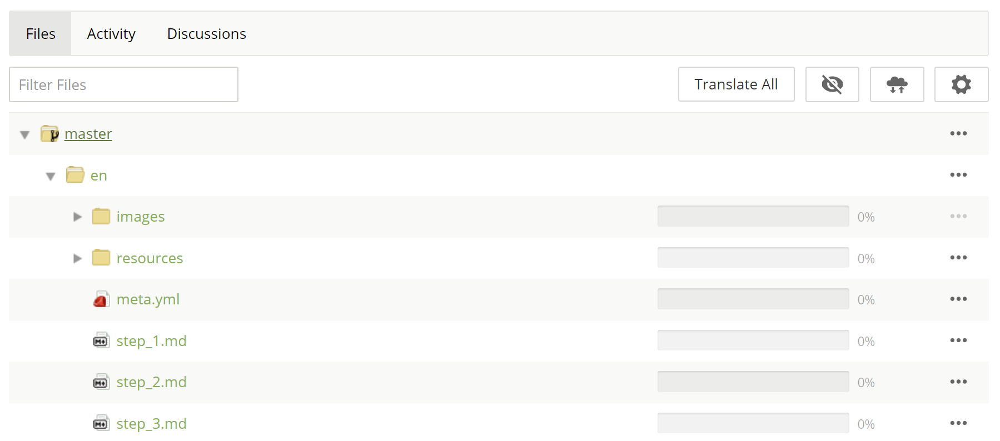
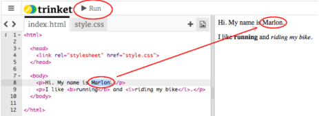

# Translating different types of files in Crowdin

Before continuing, please make sure you know how to open Crowdin in the correct mode and how to use it - if you're not sure, please read [this document](https://github.com/ninaszymor/Raspberry-Pi-Translation-Guide/blob/master/Tools/Crowdin.md).

When you open a project in Crowdin (by clicking the correct link in Task Manager) and choose your language from those available, you will see the project folders and files:

The main folder is called **master** and it contains a folder called **en** where you'll find all of the project folders and files that need translating. Below, we explain what to do with the **images folder**, the **resources folder**, the **yml file** and the **markdown files**.

## resources folder

Please begin translating the project with this folder - it contains all the resources (including the finished project code) that an educator might need to teach the project offline. Python files (.py), Scratch files (.sb2), HTML files (.html) and graphic files that contain text **should be translated**. All other files should be ignored.

You should begin with translating the finished project code:

- Python files (`*.py`) can be opened and translated via Crowdin Editor. Please make sure you follow our guidelines for [translating Python code](https://github.com/ninaszymor/Raspberry-Pi-Translation-Guide/blob/master/Technologies/Translating%20Python.md).

- Scratch files (`*.sb2`) need to be downloaded via Crowdin Editor and either translated offline if you have the offline Scratch Editor installed or uploaded to the online Scratch Editor and translated there. Please make sure you follow our guidelines for [translating Scratch code](https://github.com/ninaszymor/Raspberry-Pi-Translation-Guide/blob/master/Technologies/Translating%20Scratch.md). This is how you can download a file from Crowdin:

- HTML files (`*.html`) can be opened and translated via Crowdin Editor, which conveniently hides all HTML tags so you'll only see the displayable content. Please do not translate `*.css` and `*.js` files.

- Any graphic files should be treated in the same way as those in the **images** folder (see below).

## images folder

This folder contains graphic files and videos/gifs that visualise the various steps in the project instructions. Graphic files should be translated whenever they contain text.

- In Python and Web Development projects, graphic files will mostly include screenshots of the project code and of the program/webpage created as part of the project. Our projects use Trinket to write and run the code so you will also need to use Trinket to recreate the screenshots in your language. Click [here for an empty Python Trinket](https://trinket.io/python/b9a0534ee7) that you can use, and [here for an empty HTML Trinket](https://trinket.io/html/552244ece0). 

To recreate the screenshots, please download the finished project code (`*.py` or `*.html`) that you already translated via Crowdin Editor. Copy the code from the file and paste it into the empty Trinket, and use the translated code to take the screenshots as needed. Please note that for the HTML code to work, you will also need to download the relevant CSS and JavaScript files and add them to the HTML Trinket - get in touch with us if you're not sure what to do.

- In Scratch projects, graphic files will mostly include screenshots of Scratch Editor. You can use the finished project code (`*.sb2`) you translated earlier. 

- Some translated images will need to be edited, for example, the screenshot below has some red circles and a red arrow added. Please save the screenshot of the translated Trinket on your computer and make the required edits in an image editing program, e.g. Paint.

- Some projects use a Raspberry Pi which means you will need access to one to recreate the screenshot. We will leave you a note in the Comments column of the Task Manager so you know not to translate the project if you don't have access to a Raspberry Pi. 

- When your translated images are ready, please upload them via Crowdin Editor to replace the English source file. This is how you can upload a graphic file via Crowdin Editor:

- Some projects contain GIFs and videos. To create a GIF, you will need to record a video first. There are various tools you can use for that, for example [**Screencast-o-matic**](https://screencast-o-matic.com/screen-recorder). Once recorded, you will need to convert your video into a GIF; you can use such as [**Ezgif.com**](https://ezgif.com/). Simply got to the **Video to GIF** tab, choose the file and click **Upload video!**. You will be given the option to optimise your GIF, which we advise that you do to reduce its size.  

## yml file

Some segments in this file **should be translated**. Please translate the following lines:

- title
- description
- steps

Please **do not translate** the following segments:

- hero_image
- theme
- duration
- listed
- ingredient
- copyedit
- curriculum
- original_url
- interests
- technologies
- site_areas
- software
- version
- laste_tested

The name of the segment is displayed in the translation area, under **context**:

## .md files

These files contain the textual instructions for learners that are displayed on the website and **should be translated**. They will often refer to the different programming languages that the resources teach so please make sure your translations of these references are in line with your translation of the project code in the resources folder and in the screenshots.

Markdown files also contain a number of elements that **should not be translated**:

- Text between **triple square brackets** or **triple dashes** is part of the markdown content that our system needs to be able to recognise in order to take certain actions. Please **do not translate** it:

- The words **_title_** or **_image_** in the contexts shown below are also part of markdown content. Please **do not translate** them:

- Please **do not translate** the markdown content in **curly brackets** {}, like here: 

When translating segments with markdown content in curly brackets, please make sure you add the curly brackets in the correct place and that you do not add a space between the opening curly bracket and the word that it follows.

- Please **do not translate** names of graphic files (e.g. `file_name.png`) or URLs.

- Markdown files contain **tags** that are used to format the text (e.g. to make it bold, underline it, italicize it), to add a hyperlink, to mark a given line of text as code, and so on. Crowdin replaces these tags with these symbols: `<0> </0>`. If you see these symbols in the source segment, please make sure you include them in your translation in the correct place (and please do not change their order): 

- Please do not translate names of folders, such as `en/resources`.

## Questions and problems

If you have any questions or problems when translating the different types of files, you can post a question on Crowdin, email your fellow translators, or get in touch with Nina (nina@raspberrypi.org).
