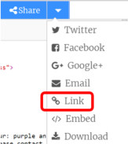

# How to translate code in Trinket

If you're a **Translator** or a **Reviewer**, open the Trinket by going to the the Task Manager and clicking the **EN Trinket/Scratch** link. If you’re a **Tester**, there is no need to use the Trinket link from the Task Manager - the translated link will be embedded in the test version of the project.

1. Once opened, translate the code (if there is any) as appropriate. You can use our guidelines for translating [Python](https://github.com/ninaszymor/Raspberry-Pi-Translation-Guide/blob/master/Technologies/Translating%20Python.md) or [HTML/CSS/JavaScript](https://github.com/ninaszymor/Raspberry-Pi-Translation-Guide/blob/master/Technologies/Translating%20HTML.md). 

2. When translated, click the **Share** button and then select **Link**:

3. Copy the URL and paste it into the **Translated Trinket/Scratch** cell in the Task Manager.

4. Please leave the translated Trinket open in your browser - you will be using it to recreate some of the screenshots that the project instructions contain. If the Trinket doesn’t contain any code, please keep it open in your browser anyway – you will still need it to recreate some of the screenshots.

5. When the code in Trinket is translated/reviewed, you can start translating the project instructions in Crowdin.
